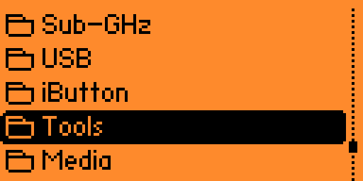

# Flipper Elements

**Periodic Table of Elements for Flipper Zero.**

**Author:** Siarhei Besarab (aka steanlab)

## App Screenshots

## Features
* **Smart Mini-Map:** Navigate precisely through rows and periods.
* **Detailed Insights:** Displays Atomic Weight, Category, Boiling & Melting points, and Quantum configuration.
* **Navigation UI:** Intuitive linear Z-based (Atomic number) chronological traversal.
* **Performance:** All 119 elements are packed entirely inside the flash memory (`.rodata`). Zero RAM overhead!

## Control Layout 
* `Up`/`Down`: Spatial vertical jump, dynamically bypassing structural table gaps.
* `Right`/`Left`: Continuous linear iteration across elements by their Atomic number `[Z]`.
* `Short Press OK`: Open detailed Element Property info-card.
* `Long Press OK`: View Author, Version and Credits info. 

## Contacts
* **LAB-66**: [t.me/lab66](https://t.me/lab66)
* **Linkedin**: [@steanlab](https://www.linkedin.com/in/steanlab)
* **Mastodon**: [@lab66](https://mastodon.social/@lab66)

## Support Development
If you found this database tool useful for your academic, educational or hacking journeys, please support the author:
* [PayPal](https://paypal.me/steanlab)
* [Revolut](https://revolut.me/steanlab)
* [GitHub Sponsors](https://github.com/sponsors/steanlab)
* [Donorbox](https://donorbox.org/donations-for-lab-66)

*Thank You!*
